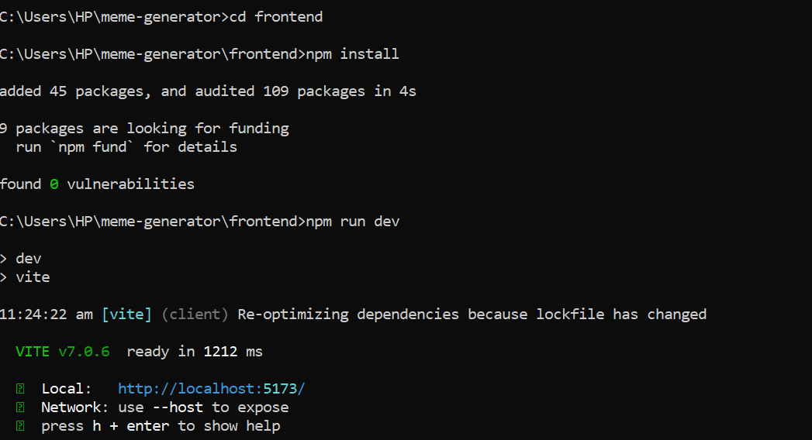
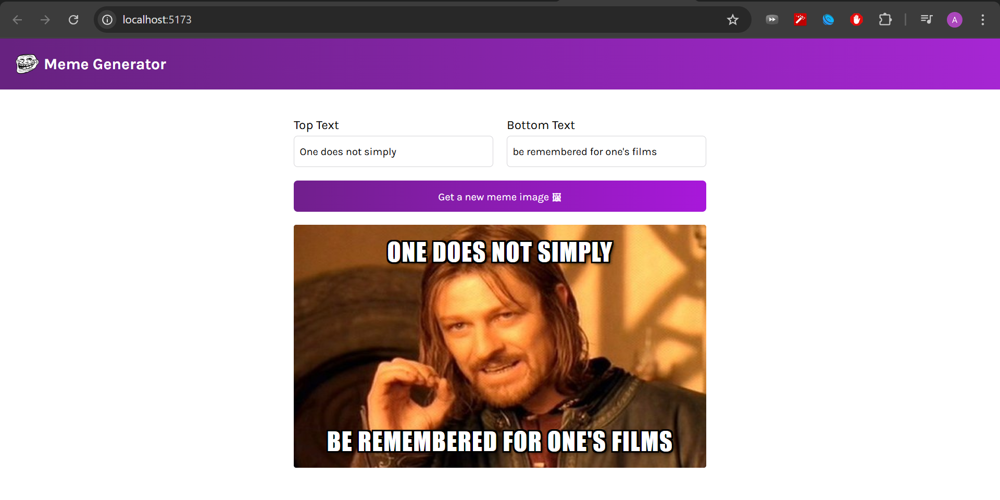

# Meme Generator Frontend

## Project Overview

This repository contains the frontend application for a Meme Generator. This interactive tool allows users to create custom memes by inputting top and bottom text, which is then overlaid onto a randomly generated meme image. The application is built with modern web technologies, providing a smooth and engaging user experience.

### Application in Action

See the Meme Generator live in your browser:



### Development Setup Screenshot

Here's a glimpse of the development server running locally:



## Features

* **Dynamic Meme Generation:** Fetches a random meme image from an external API.
* **Customizable Text:** Users can input their desired top and bottom text for the meme.
* **Real-time Preview:** See your meme come to life as you type.
* **Responsive Design:** Enjoy the meme generator on various devices.
* **Clean and Intuitive UI:** Easy to use interface for quick meme creation.

## Technologies Used

* **React.js:** A declarative, efficient, and flexible JavaScript library for building user interfaces.
* **Vite:** A lightning-fast build tool for modern web projects.
* **npm:** Package manager for JavaScript.
* **HTML5:** Standard markup language for creating web pages.
* **CSS3:** Styling language used for presenting the document.

## Getting Started

Follow these instructions to get a copy of the project up and running on your local machine.

### Prerequisites

* Node.js (LTS version recommended)
* npm (comes with Node.js)

### Installation

1.  **Clone the repository:**

    ```bash
    git clone https://github.com/Akshaj8822/meme-generator.git
    ```

2.  **Navigate to the frontend directory:**

    ```bash
    cd meme-generator/frontend
    ```

3.  **Install dependencies:**

    ```bash
    npm install
    ```

### Running the Application

To start the development server:

```bash
npm run dev
